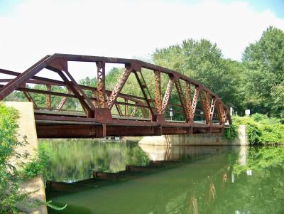

```
knitr::opts_chunk$set(fig.width=6, fig.asp = 0.618, collapse=TRUE) 
```

```{r}
#Libraries

library(ggplot2)
library(tidyverse)
library(sf)

```


#### Waterbody Impairment Time Series (1998 - 2018)

***

#### Waterbody Impairment by Basin (1998 vs. 2018)

```{r}
# R Code (LJM)

imp_1998 = read.csv("data/SC_303d_lists_1998to2004/1998303dfin_al_rec_only.csv")

imp_1998 = imp_1998 %>% 
  filter(ï..SITE != "")
dim(imp_1998)


# Reading in 2018 Impaired Waters List

imp = read.csv("data/2018303d_final.csv") 
summary(imp) # There are 861 empty rows
dim(imp) #1979 rows
imp = imp %>%
  filter(ï..PRIORITY.RANK != "") 
dim(imp)

# Determining the class of each column in 2018 Data Frame

typeof(imp$NOTE) #Character
typeof(imp$BASIN) #Character
typeof(imp$HUC_12) #Double
typeof(imp$COUNTY) #Character
typeof(imp$DESCRIPTION) #Character
typeof(imp$STATION) #Character
typeof(imp$USE) #Character
typeof(imp$CAUSE.S.) #Character
typeof(imp$ï..PRIORITY.RANK) #Character

summary(imp)

# Determining the Number of Impairments per Basin in 2018

# Basin Names
# 1. BROAD
# 2. CATAWBA
# 3. EDISTO
# 4. PEEDEE
# 5. SALKEHATCHIE
# 6. SALUDA
# 7. SANTEE
# 8. SAVANNAH

basin_impairments = imp %>%
  group_by(BASIN) %>%
  summarize(n = n())

basin_impairments_1998 = imp_1998 %>%
  group_by(BASIN) %>%
  summarize(n = n())

basin_impairments_1998

basin_impairments_1998_2018 = data.frame(Basins = c("Broad", "Catawba", "Edisto", "Peedee", "Salkehatchie", "Saluda", "Santee", "Savannah"), 
                                         Year_1998 = c(82, 53, 18, 55, 36, 54, 41, 56),
                                         Year_2018 = c(79, 113, 100, 251, 144, 133, 181, 117))

basin_impairments_1998_2018_longer = basin_impairments_1998_2018 %>%
  pivot_longer(cols = c("Year_1998", "Year_2018"), names_to = "Years",
               values_to = "Impairments")

ggplot(data = basin_impairments_1998_2018_longer) + 
  geom_col(aes(y = Impairments, x = Basins, fill = Basins)) +
  facet_wrap(~Years) +
  xlab("Basin") + 
  ylab("# of Waterbody Impairments") + 
  theme(axis.text.x = element_text(angle = 90, vjust = 0.5, hjust=1)) + 
  ggtitle("Waterbody Impairments Within Each Basin")
```

The figure (above) shows that the number of waterbody impairments in the state of South Carolina has largely increased for 7 of the 8 major river basins within the state. The Broad River basin is the only exception.  This is likely attributed to more strict water quality standards at present compared to 1998 water quality standards, however increased rates of urbanization and agricultural intensity may have caused negative water quality effects within SC waterbodies. 


***

#### Waterbody Impairment by County 


***

#### South Carolina Case Study of Waterbody Improvement

Coneross Creek and Beaverdam Creek

Fecal coliforms (FCs) are the number one cause of waterbody impairments in the state of South Carolina (349 impairments in 2018).  These bacterium emerge in human, livestock, or wildlife feces, and can be transported as nonpoint source pollution following large rainfall events.  Major sources of FCs include livestock operations and failing septic systems in rural areas.  A combination of these two sources resulted in the impairment of the Coneross Creek and Beaverdam Creek (below) in Northwest South Carolina in 1998.  Consequently, both creeks were placed on the South Carolina Dept. of Environmental Health Control (SC DHEC) 303d list of impaired waters in 1998 and deemed high priority waterbodies.  



Total maximum daily loads (TMDLs) for FCs were established for Beaverdam Creek in 2000 and Coneross Creek in 2002.  The TMDLs determine a set amount of FCs that can enter the creeks while still allowing them to meet their intended uses, which in the case of Beaverdam and Coneross Creeks, are recreational uses.  TMDL establishment allowed for the creeks to be removed from the 303d list; however, a management plan was required to reduce the amount of FCs that were entering these creeks in the past.  A collaborative team comprised of the SC DHEC, Clemson University, United States Dept. of Agriculture-Natural Resource Conservation Service, Oconee County Soil and Water Conservation Service, and Oconee County Cattlemen's Association implemented and completed a $1.1 million dollar project to restore the water quality of Coneross and Beaverdam Creeks.  The project focused on community education, restoration of failed septic systems, and best management practice (BMP) installation within the 47,016 acre Coneross Creek watershed and the 9,099 acre Beaverdam Creek watershed.  In 2005, both creeks succesfully met their TMDLs and have been restored to meet their intended recreational use.  

This is just one of the many success stories of how water quality is being improved in South Carolina's waterbodies.  However, there were 1,238 waterbodies listed on the 2018 SC DHEC 303d list, a number which is likely to increase for the 2020 303d list.  Funds must be allocated equitably across the state and stakeholders must be willing to work together to solve the wicked problem that is nonpoint source pollution.  This is a mighty task, but one that can be achieved if we South Carolinians prioritize the health of our waterbodies and hold each other accountable! 

Works Cited

United States Environmental Protection Agency. (2007, June). Homeowners and Agricultural Community Reduce Bacteria Levels in Two Oconee Country Creeks. Report No. 841-F-07-001K. 

